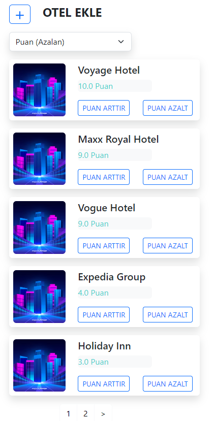
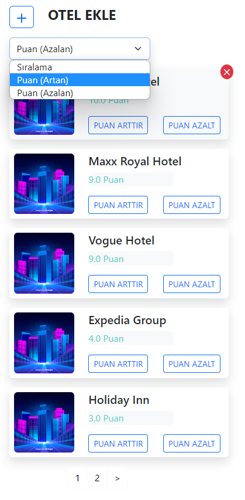
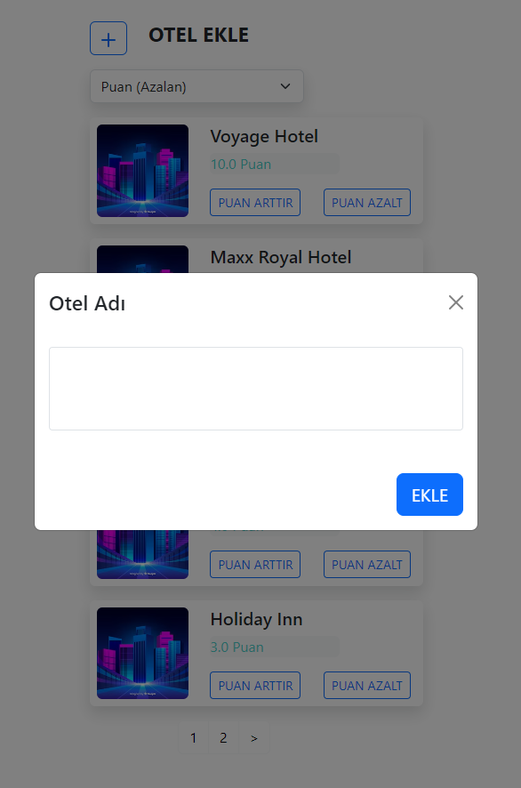
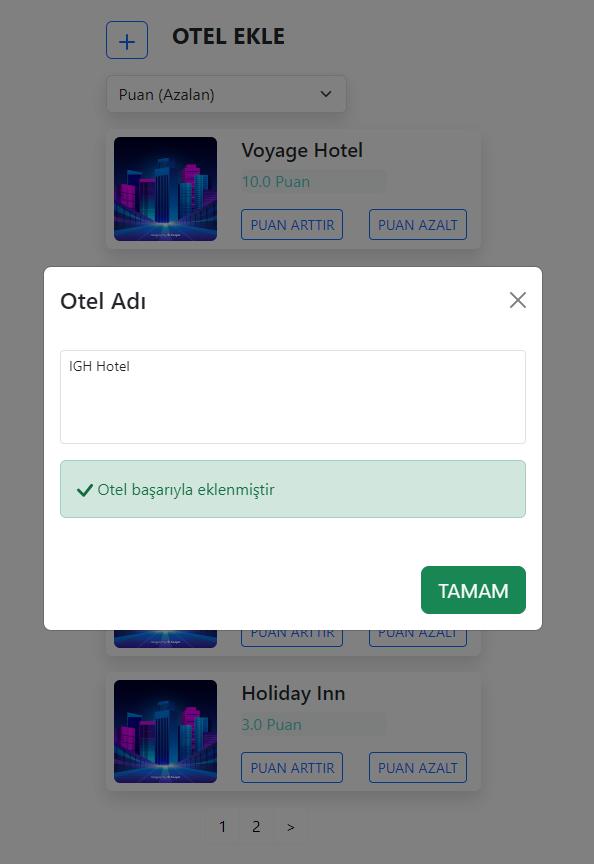
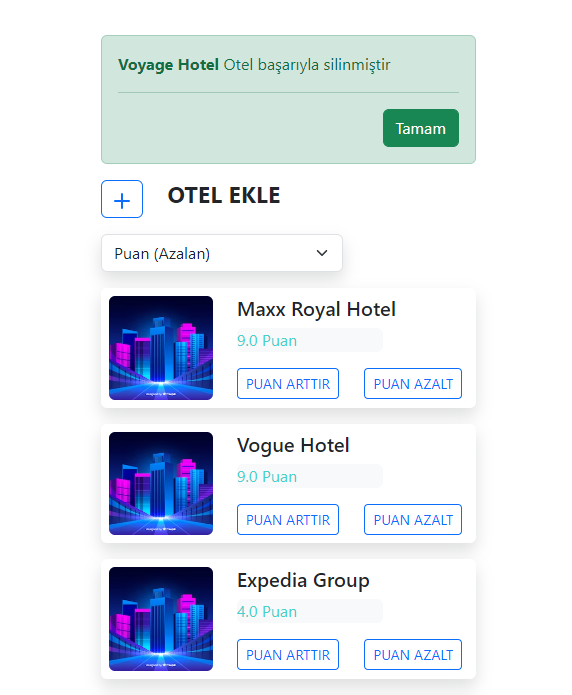

# Installation

git clone https://github.com/yigitkarabiyik/hotels-react.git

cd hotels-react

## With Node
```
npm install
npm start
```

## With Docker

```docker
docker-compose up -d --build
```

### Visit
localhost:3000/

## Screen Shots






